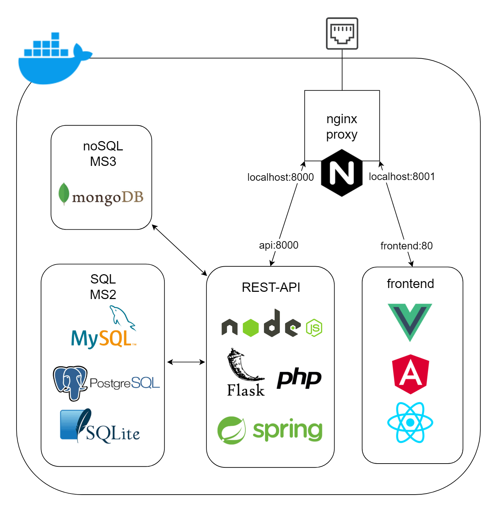
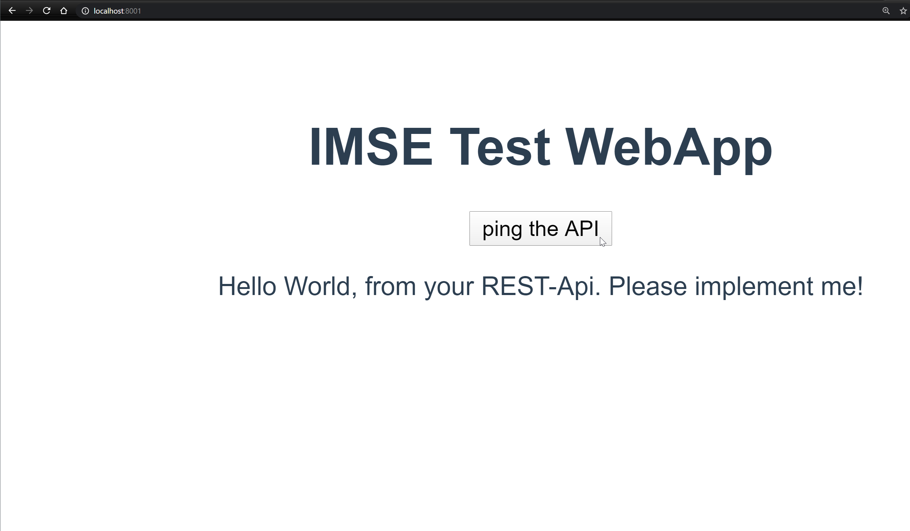

# imse_entrypoints

> How to run these:
1. install Docker, run the Docker Daemon, make sure you are logged in with your Docker-ID and that Docker is running properly.
e.g.: https://docker-curriculum.com/#getting-started
2. clone this repo and navigate into any one of the preojects.
3. run command:

```
docker-compose up --build
```
"Compose" is a tool for defining and running multi-container Docker applications.

It will run the services defined in docker-compose.yml in an isolated environment.

"up" starts and runs your entire app.

"--build" tells Docker it first has to build the images from your application. The instructions how to build the image are located in the "Dockerfile"'s inside their respective folders.

> This is how your finished project should be run when deployed!

4. navigate to:
```
localhost:8001
```
in your browser and click the button. If you get a Hello World your application is running properly.

5. To stop the running containers simply "CTRL-C" and run:
```
docker-compose down
```
to tell Docker to remove the containers we've created in #3 that are defined in docker-compose.yml.




